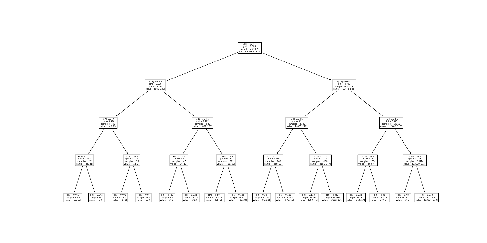
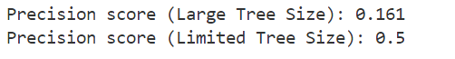

# Transparent Trading Algorithm

## Overview
The Transparent Trading Bot project aims to to create a trading bot whose decisions are understandable at a human level, making it easier for users to trust and analyze its strategy.\
This is by employing a transparent, explainable machine learning techniques, a key feature in responsible AI.
The accuracy scores of the algorithm show it is not useful in a trading function however this project provides an interesting educational example. 

## Features
- **Data Conversion:** Transforms price data into stationary data utilizing a set of 4 technical indicators (100+ columns from varying parameters and window size).
- **Mutual Information:** Employs mutual information techniques to identify the most informative columns for decision-making.
- **Transparent Decisions:** Utilizes a decision tree classifier, limited in size to ensure traceability and understandability of decisions.

## How It Works
1. **Data Extraction:** Price time series data is extracted. The function is left empty for the data source of your choice, but the development utilized the Binance API.
2. **Preprocessing:** Applies preprocessing to make the data stationary and reduces its size based on Technical Analysis (TA) signals.
3. **Decision Tree Classifier:** A decision tree classifier is trained on the data, specifically designed to be small enough so that decisions can be easily traced and understood.
4. **Performance Evaluation:** The bot's performance is evaluated, and the decision tree is plotted to visually demonstrate how decisions are being made.

## License
MIT License as shown in Licence.txt 
THE SOFTWARE IS PROVIDED "AS IS", WITHOUT WARRANTY OF ANY KIND. 

## Disclaimer
This project is provided for educational purposes only. It should not be used for financial or trading purposes. 

## Decision Diagram 

